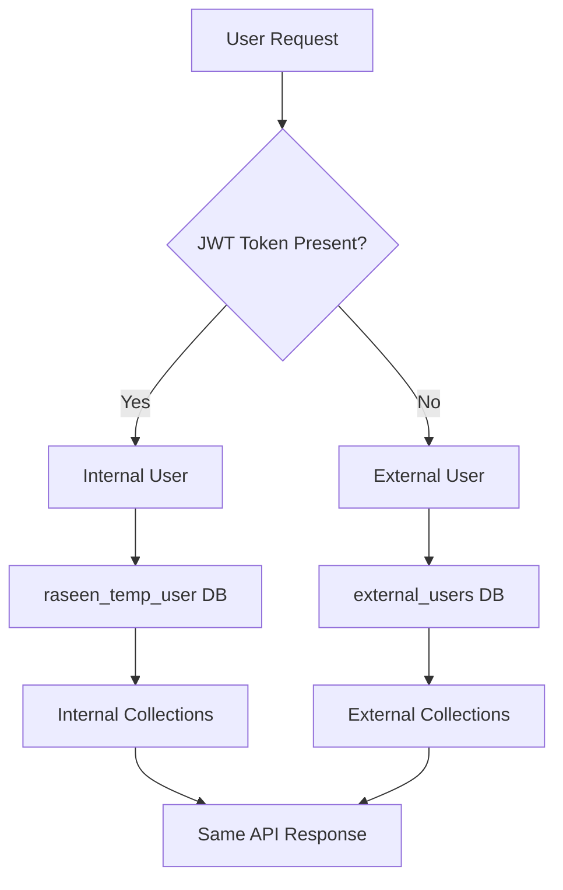
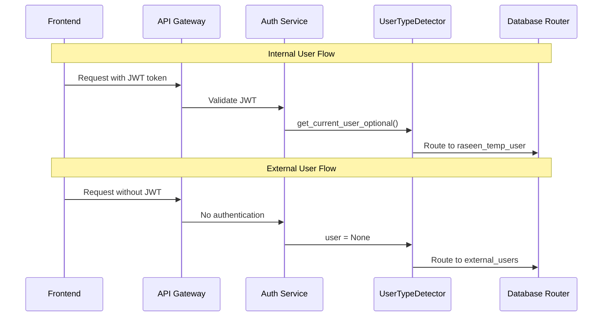

# Authentication-Based User Detection Design

## Overview

This design implements a minimal change to the existing user type detection system by removing the hardcoded whitelist and making user type detection purely based on JWT authentication status. All existing scanning endpoints, scoring logic, and analysis functionality remain completely unchanged. The only modification is in the `UserTypeDetector.detect_user_type()` method.

## Architecture

### High-Level Flow



### Authentication Flow



## Components and Interfaces

### 1. UserTypeDetector - Minimal Changes Only

**Location**: `backend/app/user_type_detector.py`

**ONLY Changes Required**:
1. Remove `INTERNAL_USER_WHITELIST` constant
2. Modify `detect_user_type()` method to remove whitelist logic
3. Keep all other methods and functionality exactly the same

**Modified Method**:
```python
@staticmethod
async def detect_user_type(request: Request, username: Optional[str] = None) -> UserType:
    """
    Detect user type based purely on JWT authentication status
    """
    try:
        current_user = await get_current_user_optional(request)
        
        if current_user is not None:
            logger.debug(f"🔐 Detected internal user: {current_user.email}")
            return "internal"
        
        logger.debug(f"🌐 Detected external user: {username or 'anonymous'}")
        return "external"
            
    except Exception as e:
        logger.debug(f"Authentication failed, treating as external user: {e}")
        return "external"
```

### 2. No Changes to Other Components

**Unchanged Components**:
- All scanning endpoints remain exactly the same
- All scoring and analysis logic remains unchanged  
- All database routing logic remains the same
- All API response formats remain identical
- All existing authentication services remain unchanged

## Data Models

### User ID Generation

**Internal Users**: `internal_{mongodb_object_id}`
- Example: `internal_507f1f77bcf86cd799439011`
- Uses actual MongoDB ObjectId from user document

**External Users**: `external_{github_username}`  
- Example: `external_srie06`
- Uses GitHub username directly

### Collection Naming

**Internal User Collections**:
- `internal_scan_cache`
- `internal_analysis_progress`
- `internal_user_profiles`

**External User Collections**:
- `external_scan_cache` 
- `external_analysis_progress`
- `external_user_profiles`

### Database Mapping

| User Type | Database | Purpose |
|-----------|----------|---------|
| Internal | `raseen_temp_user` | 24-hour temporary storage |
| Internal | `raseen_main_user` | Long-term storage (after migration) |
| External | `external_users` | Permanent public user storage |

## Correctness Properties

*A property is a characteristic or behavior that should hold true across all valid executions of a system-essentially, a formal statement about what the system should do. Properties serve as the bridge between human-readable specifications and machine-verifiable correctness guarantees.*

### Property 1: JWT-based user type classification
*For any* API request, if the request contains a valid JWT token, then the user should be classified as "internal", and if the request lacks a JWT token, then the user should be classified as "external"
**Validates: Requirements 1.3, 2.2**

### Property 2: Database routing by user type
*For any* user operation, if the user is classified as "internal", then their data should be stored in raseen_temp_user database, and if the user is classified as "external", then their data should be stored in external_users database
**Validates: Requirements 1.4, 2.3**

### Property 3: User ID prefix consistency
*For any* user ID generation, if the user is classified as "internal", then their user ID should start with "internal_", and if the user is classified as "external", then their user ID should start with "external_"
**Validates: Requirements 5.3**

### Property 4: Collection naming by user type
*For any* data storage operation, if the user is "internal", then collections should use "internal_" prefix, and if the user is "external", then collections should use "external_" prefix
**Validates: Requirements 5.1, 5.2**

### Property 5: Username independence for authenticated users
*For any* username and valid JWT token combination, the user should be classified as "internal" regardless of the username value
**Validates: Requirements 4.2**

### Property 6: Username independence for unauthenticated users
*For any* username without a JWT token, the user should be classified as "external" regardless of the username value
**Validates: Requirements 4.3**

### Property 7: Existing functionality preservation
*For any* existing API endpoint, the functionality, response format, and behavior should remain exactly the same as before the change
**Validates: Requirements 3.4, 3.5**

### Property 9: Log marker consistency
*For any* internal user operation, the logs should contain 🔐 [INTERNAL] markers, and for any external user operation, the logs should contain 🌐 [EXTERNAL] markers
**Validates: Requirements 1.5, 2.5**

## Error Handling

### Authentication Failures
- Invalid JWT tokens → Treat as external user
- Expired JWT tokens → Treat as external user  
- Missing JWT tokens → Treat as external user
- Malformed requests → Return 400 Bad Request

### Database Connection Failures
- Temporary failures → Retry with exponential backoff
- Permanent failures → Return 503 Service Unavailable
- Wrong database routing → Log error and use fallback

### GitHub API Failures
- Invalid usernames → Return 404 User Not Found
- Rate limiting → Return 429 Too Many Requests
- API unavailable → Return 503 Service Unavailable

## Testing Strategy

### Unit Tests
- Test `detect_user_type()` with various JWT token states
- Test database routing logic for both user types
- Test user ID generation for internal and external users
- Test collection name generation with proper prefixes

### Property-Based Tests
- **Property 1**: Generate random requests with/without JWT tokens and verify user type classification
- **Property 2**: Generate random user operations and verify correct database routing
- **Property 3**: Generate random user data and verify user ID prefix consistency
- **Property 4**: Generate random storage operations and verify collection naming
- **Property 5**: Generate random usernames and verify whitelist independence

### Integration Tests
- Test complete authentication flow from frontend to database
- Test unified endpoint behavior for both user types
- Test data isolation between internal and external users
- Test error handling for various failure scenarios

**Testing Framework**: pytest with hypothesis for property-based testing
**Test Configuration**: Minimum 100 iterations per property-based test
**Test Environment**: Isolated test databases to prevent data contamination